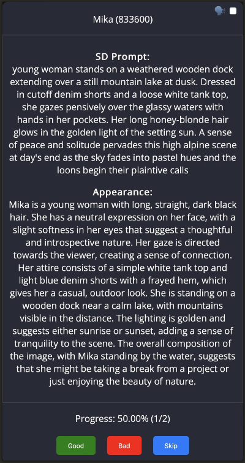

# Grader

🪄 Filter your datasets quickly!

Grader is a tool that allows you to sift through your text datasets and "grade" samples as good/bad/any other label.

Features:
- Mobile-first UI
- Nintendo Joy-Con support - grading on the go!
- On-device TTS for reading your samples out loud



## Setup
1. pull the repo

    `git pull https://github.com/kubernetes-bad/grader`

2. Edit the config file

   - Copy the contents of `default.yml` to `local.yml` (`cp config/default.yml config/local.yml`)
   - Set up your dataset values in `local.yml` (see [Configuration](#configuration)).

2. run docker compose up

    `docker compose up`

3. Populate your data into DB
    
    In your favourite MySQL client, add your data to the `input` table. Your table has to have column `id` with numeric type.

4. Access grading interface on [http://localhost:4000/](http://localhost:4000/)

5. Grade your dataset! 🪄

6. Your grades are saved into `grades` table.

# Configuration

Below are sections from config file with explanation.
```yaml
db:
  host: "host.docker.internal"  # host where your DB runs. If you're running in docker compose - leave as is 
  port: 3306
  user: "grader" # these are default values provided in docker-compose.yml
  password: "pessword123"
  database: "grader" # the main database where your dataset lives
```

```yaml
port: 4000 # port on which the Grader app will be running
```
 
```yaml
data: # This section configures how your data is presented in UI
  id: id # name of your ID column. Has to have numeric type. Grades will have the same ID 
  title: {} # Column with title of current data sample. Can be anything meaningful like "name" or "caption" - it will become the page title. Leaving this as default will result in error. 
  # title: "Title" # means that value of column "title" (for example "How to eat a cake") will become page title with text "Title: How to eat a cake".
  # name: "Character Name" # another example - value of column "name" will become page title "Character Name: Samuel"
```

```yaml
  tables: # these are the names of your tables where data to grade and grades will leave
    input: input # your dataset
    grades: grades # where to store grades
```

```yaml
  fields: {} # Names and captions for your data fields that will be presented to the user. Leaving it as default will result in error.
  # column1: "Column 1 Label" # This will be shown to the user as "Column 1 Label: <value of column1>
  # description: "Character Description" # Here's a more concrete example: value of column 'description' will be displayed as "Description: Maria is 32-year old woman..."
```

```yaml
  buttons: # This section defines labels and values for your buttons
    good:
      label: Good # Literally what it will say on the button
      color: green # color of the button
      keyboardButton: "1" # has to be a string!
    bad:
      label: Bad
      color: red
      keyboardButton: "2"
    skip:
      label: Skip
      keyboardButton: "3"
```

# Nintendo Joy-Con

Grader supports Nintendo Joy-Con bluetooth controllers for simplified grading.
Currently, there is no way to re-map buttons without code editing (/public/script.js).

Button map:
- 1 on keyboard is Y on Joy-Con, default label "Good"
- 2 on keyboard is X on Joy-Con, default label "Bad"
- 3 on keyboard is A on Joy-Con, default label "Skip"
- ` (backtick) on keyboard is B on Joy-Con, starts-stops TTS


# TTS

It uses on-device text-to-speech engine through browser's accessibility standards, so it should work across devices and operating systems. To select the voice - select your system text-to-speech voice. It was tested on Apple iPhone.
